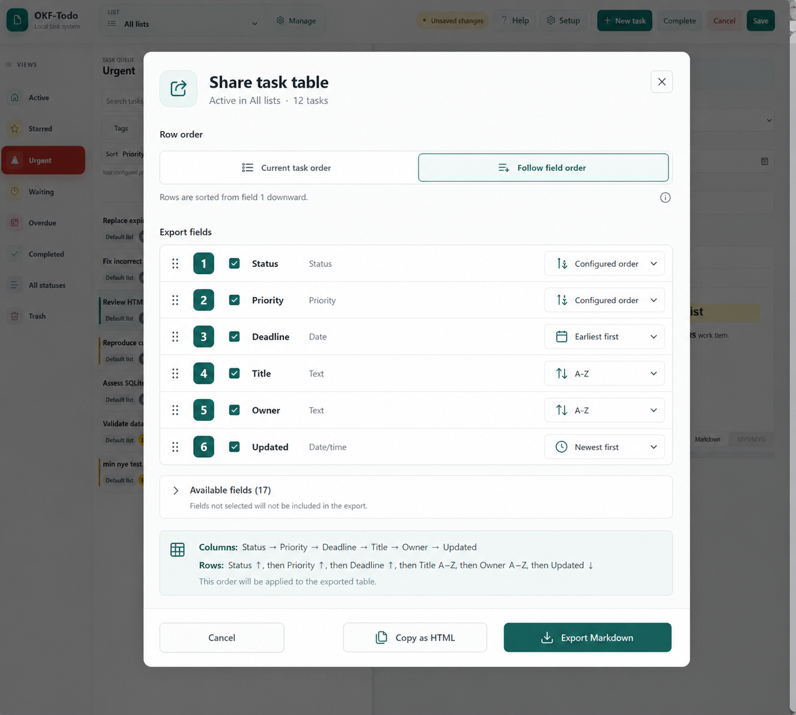
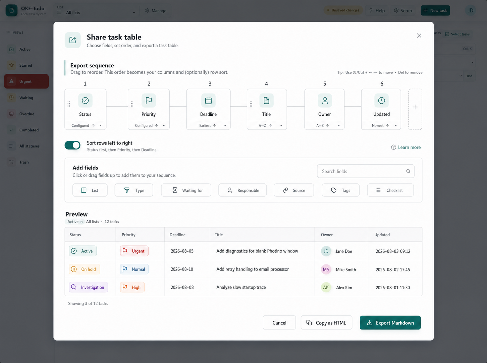
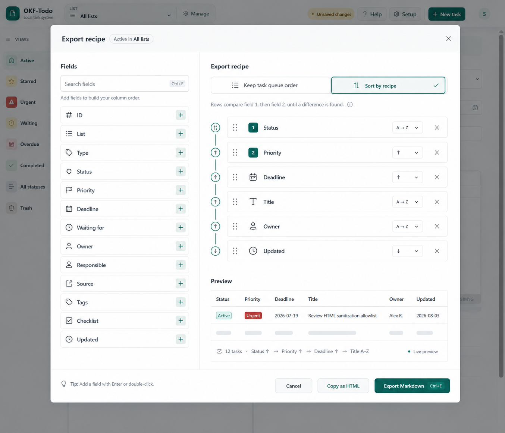

# Task export redesign options

These concepts were generated on 2026-08-03 to rethink export field selection, column order, and row sorting.

## Option 1 — Ordered canvas

A single ordered field list makes column position and optional recipe sorting visible in one compact surface.

## Option 2 — Export runway

A horizontal sequence emphasizes the exported table from left to right and adds a larger live preview.

## Option 3 — Export recipe

A two-pane composer separates the field library from the selected export recipe. The recipe is the authoritative column order. **Sort by recipe** explicitly opts into using that same sequence as a composite row sort.

## Decision

Option 3 is selected for implementation. It scales to the complete field set, keeps adding and removing fields obvious, supports drag and keyboard reordering, and explains the relationship between column order and row sorting without making that relationship implicit.
