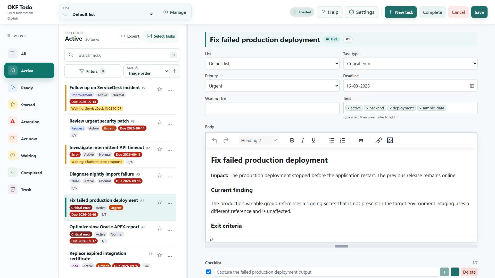
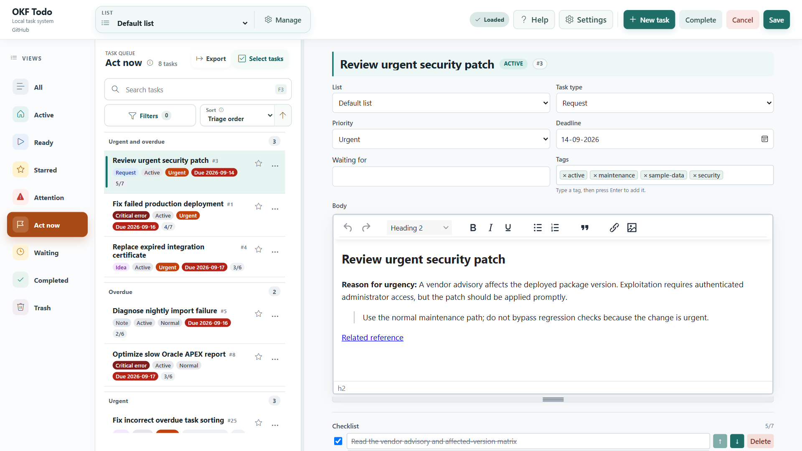
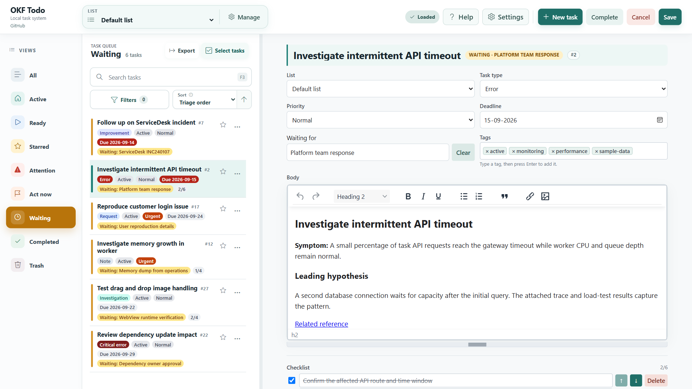
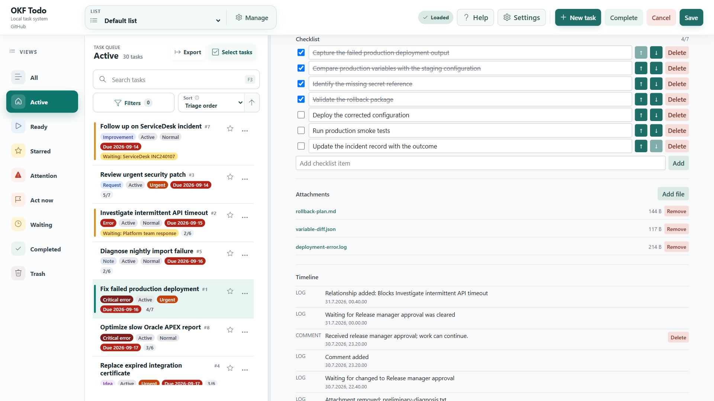
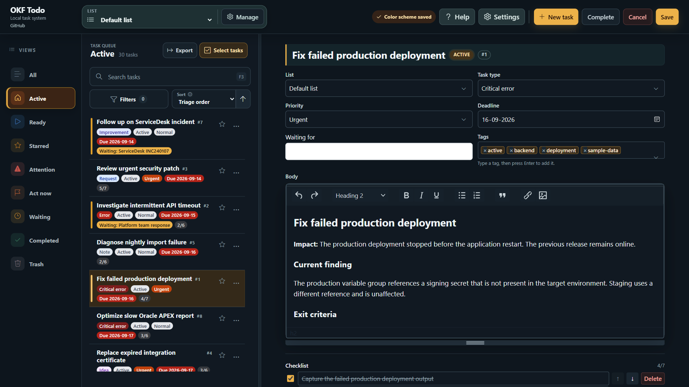
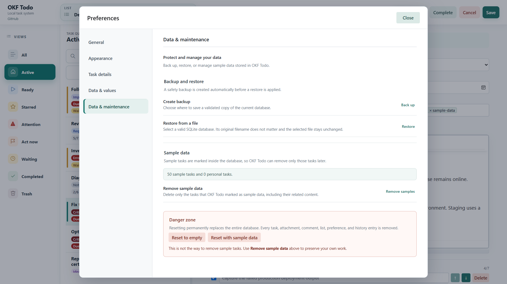
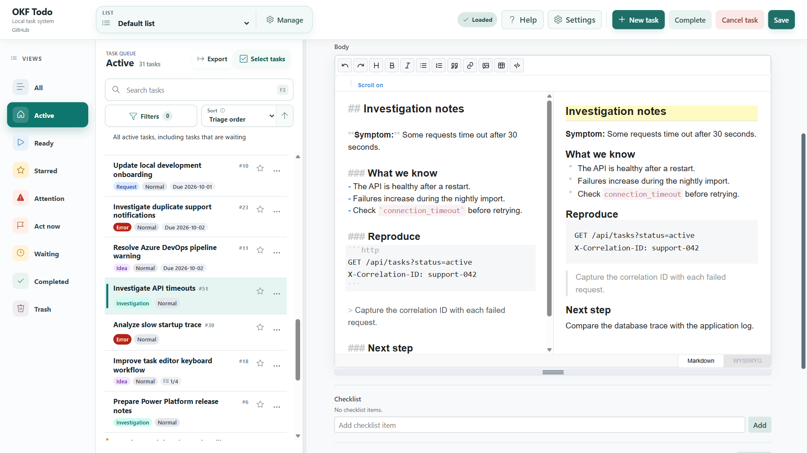

# OKF Todo in pictures

Take a quick tour of OKF Todo, from organizing daily work to writing notes and protecting your data. These screenshots use fictional sample tasks. Select any image to open it at full size.

- [Your task workspace](#your-task-workspace)
- [Focus on what needs action](#focus-on-what-needs-action)
- [Keep waiting work visible](#keep-waiting-work-visible)
- [Keep the details together](#keep-the-details-together)
- [Work in dark mode](#work-in-dark-mode)
- [Protect your local work](#protect-your-local-work)
- [Write in Markdown](#write-in-markdown)

## Your task workspace

Keep development and support work in one local workspace, with task notes, priorities, deadlines, and tags. No online account is required.

## Focus on what needs action

Use **Act now** to find urgent and overdue work that is not waiting on someone else.

## Keep waiting work visible

See what is waiting, who or what you are waiting for, and the context behind each task.

## Keep the details together

Track checklist progress, attach supporting files, and follow comments and change history in the **Timeline**.

## Work in dark mode

Choose a light or dark theme to suit your workspace.

## Protect your local work

Create database backups and restore from a file. Before restoration, OKF Todo creates a safety backup of your current data.

## Write in Markdown

Write task notes with Markdown source and a live preview side by side. Use headings, lists, quotations, and code snippets to keep investigation notes readable.

[Read the user guide](help/using-okf-todo.md) · [Back to the main README](../README.md)
