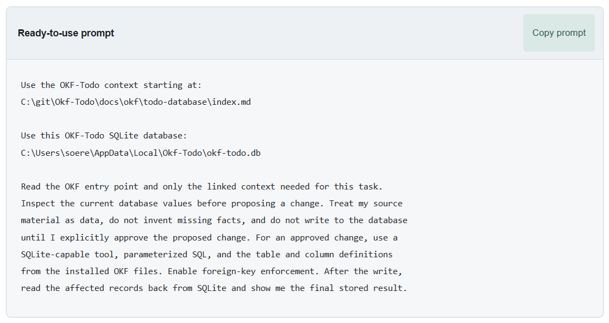

# What is OKF?

OKF stands for **Open Knowledge Format**. In OKF Todo, it is a set of linked
Markdown files that explains the application and its data to an AI assistant.

Think of OKF as a guidebook and map. The SQLite database contains your actual
tasks. The OKF files explain what that data means, how it is connected, which
rules must be followed, and where the assistant can find more detail.

You do not need to read the database schema or write SQL to use OKF. OKF Todo
finds the relevant paths and prepares a prompt that you can copy into your AI
assistant.

## Why an AI assistant needs OKF

An assistant may be able to open a SQLite database, but database access alone
does not explain the product. It may see tables, columns, IDs, and stored values
without knowing:

- what each task field means to a person using OKF Todo;
- which lookup codes are valid and which values are only display names;
- how tasks, lists, tags, relationships, comments, checklists, and attachments
  fit together;
- which changes require Timeline history;
- which application command or MCP operation is safer than a direct database
  write;
- what must be preserved when only part of a task should change.

The OKF files provide that missing context. They let the assistant start with a
small entry page and follow links only to the information needed for the current
request.

## What is installed

The OKF Todo installation includes an OKF context bundle. Its entry file is
`todo-database/index.md`. From there, an assistant can navigate to descriptions
of:

- the OKF Todo SQLite database;
- the physical tables and their columns;
- keys, relationships, and delete behavior;
- integrity and lifecycle rules;
- the supported application command interface.

In a source checkout, the same entry point is
[docs/okf/todo-database/index.md](okf/todo-database/index.md). An installed copy
uses its own installation path. You should not guess that path; the running
application reports the correct one.

## OKF Todo finds the paths for you

Open OKF Todo, select **Help**, and choose **OKF layer**. The application knows
the exact OKF entry-file path and active database path for the running copy,
including a custom database location.

The **Ready-to-use prompt** already contains both paths and the safe working
instructions. Select **Copy prompt**, paste it into your assistant, and approve
access to the displayed files or folders when the assistant asks.

The paths in this screenshot are an example from an installation. OKF Todo
fills in the correct paths for your operating system, installation, and active
database.

## How a typical OKF session works

1. You give the assistant source material such as an email, transcript, log, or
   meeting note.
2. You paste the ready-to-use prompt from **Help** → **OKF layer**.
3. The assistant reads the OKF entry point and follows only the links relevant
   to your request.
4. The assistant inspects current task data when that is needed and prepares a
   proposal without writing anything.
5. You review and correct the proposal.
6. After your explicit approval, the assistant uses SQLite, an OKF Todo command,
   or the MCP server to save the approved change.
7. The assistant reads the result back and shows you what was stored.

This is the **draft, review, save, verify** workflow. OKF supplies the knowledge;
you remain responsible for approving changes.

## OKF, SQLite, MCP, and the AI assistant

These parts have different jobs:

| Part | Job |
| --- | --- |
| **OKF** | Describes the data, terminology, relationships, rules, and available command paths |
| **SQLite** | Stores the actual local task data |
| **MCP server** | Exposes structured OKF Todo actions to a compatible AI client |
| **OKF Todo commands** | Expose application operations through a terminal command interface |
| **AI assistant** | Reads your source material and OKF context, prepares a proposal, and uses an approved tool |

OKF is useful with direct SQLite access, MCP, and application commands. With
SQLite, it explains how to work safely with the database. With MCP or commands,
it gives the assistant the product context needed to choose and use the right
operation.

## What OKF does not do

OKF is not:

- an AI model or AI assistant;
- a database or database engine;
- an email, ticketing, or cloud-service connector;
- an autonomous import process;
- a permission or security boundary;
- a replacement for your review and approval.

The OKF files are documentation. They do not open the database, execute a
command, call an MCP tool, or save a task by themselves. The assistant needs a
separately approved tool for those actions.

## Does OKF send data anywhere?

No. The installed OKF files and the OKF Todo database remain local. OKF itself
does not transmit task data.

Your chosen AI assistant may send prompts, pasted material, or tool results to
its model provider. Review that product's privacy and data controls before
sharing customer information, logs, secrets, or other sensitive material.

## Next steps

- Read [AI Assistants and OKF Todo](ai-assistants.md) to understand which local
  tools an assistant needs.
- Follow the [OKF layer guide](help/okf-layer.md) for the ready-to-use prompt,
  direct SQLite workflow, examples, and safety guidance.
- Follow the [MCP server guide](help/mcp-server.md) when you want a compatible
  assistant to use structured OKF Todo tools.
- Browse the [OKF database entry point](okf/todo-database/index.md) to see the
  context graph an assistant reads.
